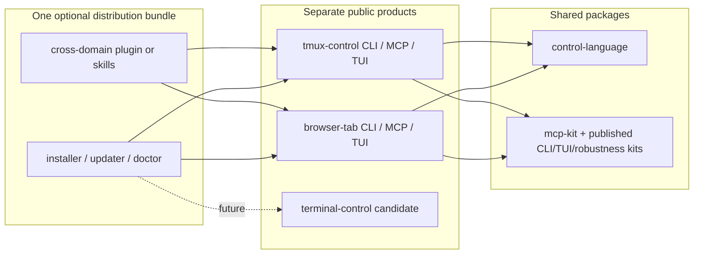

# Deep Application Control Platform Architecture

**Status:** exploratory planning companion  
**Date:** 22 August 2026  
**Scope:** package, product, process, MCP, CLI, TUI, and adapter boundaries beyond browser tabs  
**Related browser semantics:** [Tab Selection and Transformation Language](./tab-selection-transformation-language-spec.md)

## 1. Executive recommendation

Keep one monorepo while the architecture is still being discovered, but expose several coherent domain products rather than one universal mutation MCP.

The preferred near-term shape is:

```text
one source monorepo
├── browser-tab product       browsers, windows, groups, tabs
├── tmux-control product      servers, clients, sessions, windows, panes
├── shared control-language   selection only at first
└── existing infrastructure  MCP, CLI/TUI, logging, build and test kits
```

The important design principle is:

> Share the algebra, runtime guarantees, and reusable UI state where they are genuinely common. Specialize the ontology, effects, permissions, and public vocabulary.

This is intentionally between two extremes:

- not one generic `manage_items` MCP containing every application;
- not one repository, daemon, and infrastructure stack for every individual app.

Browser products belong together because they expose substantially the same window/group/tab model and cross-browser copy/cut is useful. Tmux deserves its own public surface because its entities and transformations are materially different. Terminal emulators are a candidate family, not yet a proven one.

One installer, one release bundle, one background supervisor, one executable file, and one MCP tool catalog are **five separate decisions**. They do not need the same answer.

## 2. Four boundaries that must not be conflated

The architecture discussion becomes clearer when these decisions are made independently:

1. **Repository boundary:** which products evolve and test together?
2. **Package boundary:** which code and contracts are reusable?
3. **Runtime/process boundary:** which services share memory, lifecycle, permissions, and failure?
4. **Human/model surface boundary:** which commands and tools appear together and share vocabulary?

A shared monorepo does not imply one MCP. Separate MCP catalogs do not require duplicated libraries. Separate logical MCPs may later share one supervised local host. One installer can register several domain MCPs.



## 3. Domain models

### 3.1 Browsers

The useful browser projection is an ordered forest:

```text
browser instance/profile
└── window
    ├── tab
    ├── native group metadata over a contiguous tab interval
    └── tab
```

Tabs are live-movable only inside a runtime-derived domain. Crossing that boundary reconstructs a page through copy or cut. Native groups are browser/window-local metadata, not universal container objects.

### 3.2 Tmux

The precise tmux relationship is:

```text
tmux server
├── client ──attaches to──> session
└── session
    └── linked window
        └── pane
```

A session is not a client. The tmux server owns sessions; clients attach to them. A window can be linked into more than one session, and sessions in a session group share and synchronize their window set. That makes the underlying model a graph with useful ordered projections, not a strict ownership tree.

Tmux already provides most of the required control plane:

- format-driven `list-sessions`, `list-windows`, and `list-panes` for deterministic snapshots;
- control mode for commands, subscriptions, and change notifications;
- `move-window` and `link-window` for session membership;
- `join-pane`, `move-pane`, and `break-pane` for pane structure;
- `capture-pane` for bounded scrollback inspection;
- attach/detach and session-group behavior.

The tmux product should be a relatively thin semantic, safety, observability, and AI-ergonomics layer over tmux itself. It should not clone the browser daemon merely for architectural symmetry. Current official references include the [tmux control-mode documentation](https://github.com/tmux/tmux/wiki/Control-Mode) and [getting-started model](https://github.com/tmux/tmux/wiki/Getting-Started).

### 3.3 Terminal emulators and nested tmux

Terminal presentation and tmux process state are separate layers:

```text
terminal app -> OS window -> terminal tab/split -> TTY
                                                   ^
                                                   | typed correlation
                                                   v
tmux server -> session -> linked window -> pane -> TTY
```

A visible terminal tab must not be collapsed into a tmux window merely because they occupy the same rectangle. A typed TTY/process relationship can correlate them without pretending they have one identity or one lifecycle.

iTerm2, Kitty, Terminal.app, Ghostty, Warp, Hyper, and other terminals vary substantially in scripting, pane, tab, restoration, plugin, and state-migration capabilities. A common `terminal-control` product should be created only after two unlike adapters prove a useful shared contract. Until then, share infrastructure and keep advanced adapter capabilities domain-specific.

### 3.4 Finder and other applications

The presence of “tabs” is not enough to establish a domain family. Finder tabs, editor workspaces, document windows, chat conversations, and design canvases differ in identity, persistence, state transfer, permissions, and destructive effects.

An application should join an existing family only when it shares:

- a user mental model;
- stable entity and ordering semantics;
- a meaningful common selector vocabulary;
- compatible state-preservation boundaries;
- similar permissions and risk;
- enough shared transformations to make the public tool catalog clearer rather than vaguer.

Otherwise it may use the shared selection package while exposing an app-specific product.

## 4. Reusable semantic core: ordered views, not one universal tree

The strongest common abstraction is selection over a finite ordered view.

```ts
interface SelectionDomain<Ref, Kind, Field> {
  kindOf(ref: Ref): Kind;
  stableKey(ref: Ref): string;
  universe(kind: Kind, scope: Ref): readonly Ref[];
  orderedMembers(scope: Ref, relation: string, kind: Kind): readonly Ref[];
  readField(ref: Ref, field: Field): unknown;
}
```

This interface is illustrative rather than frozen. Its purpose is to keep the generic evaluator ignorant of browser APIs, tmux commands, process topology, persistence, and effects.

A general resolved occurrence may need:

```ts
interface ResolvedOccurrence<Ref> {
  projectionId: string;
  occurrenceId: string;
  entity: Ref;
  branchPath: readonly string[];
  ordinal: number;
}
```

Browsers can adapt their current tree directly. Tmux can expose `session -> linked window` and `window -> pane` ordered views over its graph. Position, sibling, range, and `withinEach` operate on occurrences in one projection. Effects decide whether to target an occurrence/link or the underlying entity.

The shared language should initially own only:

- versioned selector schemas;
- identity and finite scope;
- signed positions, offsets, and ranges;
- explicit relation/member projection;
- same-kind union, intersection, subtraction, and complement;
- predicates through a typed domain field catalog;
- deterministic order, sort, slice, expansion, and `withinEach`;
- branch/provenance retention;
- normalization, complexity limits, validation, and pure resolution;
- synthetic fixtures and property-based laws.

It should not initially own a graph database, live event store, daemon, persistence, MCP tools, browser movement, tmux linking, undo, or universal transformation classes.

## 5. Transformations remain domain-specific

Names that look universal often conceal incompatible semantics:

- browser `move` preserves a live tab only within one live-move domain;
- tmux `move-window` changes a session link and can affect membership;
- tmux `link-window` shares the same live window across sessions rather than copying it;
- `join-pane` and `break-pane` change hierarchy while preserving the process;
- many terminal adapters cannot migrate a running shell between app windows;
- a Finder tab may be reconstructible from a location but not from transient UI state.

Use a common plan envelope only after it proves useful:

```ts
interface Plan<Effect> {
  snapshotRevision: string;
  selection: ResolvedSelection;
  effects: readonly Effect[];
  preconditions: readonly Precondition[];
  warnings: readonly Impact[];
  postconditions: readonly Postcondition[];
}
```

The effect payload remains domain-specific. Capabilities should also be semantic and namespaced:

```text
browser.tab.move.live
browser.tab.transfer.reconstruct
browser.group.create
tmux.window.move
tmux.window.link
tmux.pane.join
terminal.tab.reorder
```

A generic `canMove` flag is too lossy and will produce unsafe or misleading plans.

## 6. Proposed repository and package shape

Do not create a dozen packages in anticipation of reuse. Extract one shared package first:

```text
packages/control-language
```

Working package name:

```text
@george43g/control-language
```

It contains the pure selection language and ordered-view adapter described above.

As browser selection/planning becomes real, extract one cohesive browser package:

```text
packages/browser-control
```

It may contain the browser binding, predicate catalog, destinations, live-move-domain calculation, browser effect IR, empty-window/group/pin policies, planner, and reconciliation. It should not immediately be split into model, planner, runtime, adapter, and persistence micro-packages.

The first tmux spike can use:

```text
apps/tmux-control
packages/tmux-control
```

Only after browser and tmux contain demonstrably duplicated revision stores, plan runners, operation journals, UI state, or adapter contracts should those pieces be promoted into packages such as `control-runtime`, `control-ui-model`, or `control-adapter-sdk`.

The current repository already provides several useful seams:

- `mcp-kit` is genuinely generic and should remain so;
- the published CLI, TUI, and robustness kits remain dependencies and should not be re-vendored;
- `extension-core`, WebExtension wiring, browser detection, handles, and `cgWindowId` correlation remain browser-specific;
- `shared-types` is browser-specific in practice despite its name and should not become a cross-domain dumping ground;
- `tabs-service` is a useful future browser package boundary, but rewriting it before the selector exists would be premature;
- the existing resources implementation can serve selection, plan, and operation records after its content-block support grows.

Nested package directories are optional organization. The present workspace glob includes `packages/*`, so deeper packages would require an explicit workspace change. Directory depth is not architecture.

## 7. Product, CLI, MCP, and process topology

### 7.1 Recommended public products

```text
browser-tab    Chrome/Chromium/Brave/Edge/Safari tab-domain control
tmux-control   tmux server/client/session/window/pane control
terminal-control  future candidate after at least two proven adapters
```

Each product gets domain-specific tool names, CLI help, completions, man pages, schemas, examples, TUI language, permissions, and operation journals.

Do not expose generic model-facing tools such as:

```text
list_items
select_nodes
move_nodes
manage_app
```

The generic vocabulary may exist internally. Public tools should say `select_tabs`, `select_tmux_panes`, `link_tmux_window`, or similarly precise names.

### 7.2 One distribution without one command language

An optional umbrella executable or installer can remain useful for operations rather than mutation:

```text
app-control adapters
app-control doctor browser
app-control install-mcp tmux
app-control status
```

It should not become `app-control move --kind item`.

One physical executable could also dispatch to separate domain entry points or install executable aliases while keeping help and schemas isolated. Likewise, one future supervisor may host several adapters behind separate MCP projections. Deployment consolidation must not leak a giant tagged union into the model-facing schema.

### 7.3 Daemons

The browser daemon has real responsibilities: browser-extension sockets, AppleScript fallback, merged snapshots, correlation, journal state, caching, and command routing.

Tmux already is a persistent server and exposes control mode. The first tmux product should talk directly to tmux and add a daemon only if persistent journal, subscription fan-out, or TUI lifecycle measurements justify one.

A future shared supervisor is an optimization, not a starting premise. Build it only after measuring duplicated polling, memory, startup time, permission prompts, or lifecycle pain.

## 8. MCP and plugin boundary

Current MCP and Claude guidance supports the following division:

- MCP servers provide live capabilities and data;
- a plugin or skill teaches agents when and how to use them;
- local desktop control is an appropriate local MCP/MCPB use case;
- read and write behavior should be clearly separated, with truthful tool annotations and narrow descriptions.

Relevant current references include the [MCP tool specification](https://github.com/modelcontextprotocol/modelcontextprotocol), [Claude MCP guidance](https://claude.com/docs/connectors/building/mcp), [MCPB guidance](https://claude.com/docs/connectors/building/mcpb), [connector review criteria](https://claude.com/docs/connectors/building/review-criteria), [testing guidance](https://claude.com/docs/connectors/building/testing), and [MCP versus plugin guidance](https://claude.com/docs/connectors/building/what-to-build).

The cross-domain plugin/skill should:

- route browser, tmux, and terminal intents to the appropriate server;
- teach analogous concepts and crucial differences;
- provide multi-server recipes;
- correlate read-only context where safe;
- preserve each server's planning, permissions, confirmation, and failure boundary.

It should not expose a generic mutation tool or imply a transaction across servers.

## 9. Optional read-only federation

If users repeatedly ask questions such as “what active work exists across my browsers, tmux sessions, and terminal tabs?”, a small read-only federation product may eventually be justified.

It could expose:

- enabled domain adapters and health;
- compact active/focused/MRU summaries;
- typed cross-domain correlations such as terminal TTY to tmux pane;
- resource links back to domain-owned details.

It should not centralize raw browser page text, pane scrollback, shell history, or write authority. It should not be built until a real cross-domain query corpus exists.

## 10. Tmux observability and safety

Tmux metadata can include server/socket identity, session and group names, client attachments, window and pane names, indexes, creation/activity times where available, active/last-used state, pane process/TTY/size, layout, modes, and links.

Pane scrollback and shell history require stricter treatment:

- default snapshots contain metadata, not pane content;
- `capture-pane` is an explicit, bounded read;
- returned content is untrusted data and is sanitized/wrapped accordingly;
- byte and line ranges are mandatory;
- persistence is opt-in and separately retained;
- shell command history is not treated as equivalent to tmux scrollback;
- known secret patterns may be redacted, but redaction is never represented as a complete confidentiality guarantee;
- captured content should not enter ordinary logs, selection records, or federation snapshots.

Write tools must map typed operations to enumerated tmux commands. A community adapter contract must not become arbitrary shell execution through an opaque `command` argument.

## 11. Community adapter model

Community adapters are plausible, but dynamic extensibility must not destabilize the AI schema or weaken local security.

A future adapter manifest may declare:

- domain and adapter identity;
- node kinds and ordered views;
- typed fields and predicate operators;
- capabilities and their runtime probes;
- domain-specific effects and risk metadata;
- CLI/TUI labels and examples;
- observation and execution entry points;
- required permissions and content-retention behavior.

Prefer allowlisted packages or isolated adapter processes over loading arbitrary code into a privileged universal daemon. Adapter installation may change an installation profile, but transient connection state should not churn `tools/list`; availability belongs in observations and preflight results.

Publish a general adapter SDK only after an external or second-repository consumer exists. Until then, an internal interface can evolve without false compatibility promises.

## 12. Anti-abstraction rules

- Do not force every domain into `window -> group -> tab`.
- Do not replace the current browser Snapshot with a universal graph store merely to serve a future tmux adapter.
- Do not universalize move/copy/cut semantics.
- Do not confuse a visual containment view with ownership or identity.
- Do not leak generic `node`, `branch`, and `leaf` words into domain help where tab, pane, window, or session is clearer.
- Do not expose arbitrary object paths as predicates; use a typed domain field registry.
- Do not let a union of capabilities make an effect appear supported for every selected member.
- Do not duplicate the browser daemon for tmux without a measured need.
- Do not create micro-packages merely to make `apps/` small.
- Do not publish an adapter SDK before another consumer tests it.
- Do not aggregate sensitive content merely because metadata can be aggregated.
- Do not claim secret redaction makes pane or shell history safe.
- Do not make tool discovery vary with short-lived adapter liveness.

## 13. Phased implementation sequence

### Phase 0 — freeze semantics through evidence

- Resolve the browser spec's open policy choices.
- Distinguish schema version from snapshot revision.
- Define stable/snapshot-bound identity rules.
- Run model-facing schema evaluations before freezing recursive or step-program authoring.

### Phase 1 — extract only `control-language`

- Implement the pure typed selector and ordered-view adapter.
- Use a tiny synthetic ordered-view fixture plus the browser snapshot binding.
- Property-test same-kind algebra, signed positions, projection, branch ordering, and `withinEach`.

### Phase 2 — bind browsers

- Add browser node kinds, fields, scopes, temporal unknown policy, live-move-domain metadata, and capability aggregation.
- Return materialized selections with revision, total order, partitions, and operator availability.
- Preserve existing focused tools during migration.

### Phase 3 — browser planning and execution

- Add the small browser effect IR and `setOrder` escape hatch.
- Implement read-only planning, conflict checks, operation journal, cooperative cancellation, actual-state verification, and residual plans.
- Expose risk-coherent browser MCP tools and resources.

### Phase 4 — thin tmux spike

- Build format-driven snapshots and a control-mode event reader.
- Support selection without content capture first.
- Add domain effects for attach/detach, window move/link, and pane join/break only after dry-run semantics are clear.
- Exercise linked windows and session groups specifically to challenge the selection abstraction.

### Phase 5 — extract proven duplication

- Compare browser and tmux revision, event, plan, operation, and TUI code.
- Extract `control-runtime`, `control-ui-model`, or `control-adapter-sdk` only where two implementations have the same contract.

### Phase 6 — test a terminal family

- Pilot two unlike adapters, for example iTerm2 and Kitty.
- Preserve adapter-specific capabilities rather than flattening to the weakest common denominator.
- Add read-only terminal-to-tmux TTY correlation.

### Phase 7 — optional federation and supervisor

- Build a read-only federation product only from a real cross-domain query corpus.
- Build a supervisor only from measured process/lifecycle cost.

## 14. Evaluation and research plan

### 14.1 Empirical model evaluation

Use the deterministic fake browser and synthetic selection domain to compare:

- recursive selector objects versus bounded named-step programs;
- inline selection versus materialized `selectionId`;
- one polymorphic mutation tool versus risk-coherent tools;
- direct mutation versus plan-first apply.

Run the same golden corpus across the intended Claude, OpenAI, Gemini, and smaller/local model families. Measure correct tool choice, schema validity, semantic selection correctness, repair turns, token cost, destructive mistakes, stale-state behavior, latency, and final residual correctness.

This experiment is more valuable than assuming one model or notation will behave best.

### 14.2 External research agents

No additional external research agent is required to make the current architectural recommendation. The decisive evidence came from the live repository, current primary documentation, and adversarial design review.

External agents may be useful for bounded later studies:

- a deep-research agent can build a cited capability matrix for terminal-emulator APIs and extension models;
- a documentation crawler such as Firecrawl can inventory official adapter documentation when direct sources are fragmented;
- Perplexity-style research can find broad references, but implementation claims should be verified against primary documentation;
- X/Grok research can surface user pain and desired workflows, but posts are demand signals rather than architecture authority;
- a separate model-evaluation runner should produce tool calls against the fake adapter rather than merely write another opinionated design memo.

Each study should have a fixed question, source-quality policy, output schema, and decision it can change.

## 15. Multi-review debate record

Three independent review lenses were used:

1. **Selection semantics:** demanded same-kind closure, explicit structural projection, branch partitions, live-move preflight, and a smaller transform set.
2. **Platform architecture:** separated repository/package/process/surface boundaries, corrected the universal tree assumption through tmux links, and warned against premature packages or supervisors.
3. **MCP/model ergonomics:** challenged the two-tool mutation surface, proposed risk-coherent tools and materialized plans/resources, and suggested evaluating a named-step selection program.

The cross-critique resolved the major tensions as follows:

| Tension | Resolution |
|---|---|
| Universal tree versus graph | The generic language evaluates finite ordered views. Domains may use trees or graphs internally. |
| Recursive AST versus step program | Keep one semantic IR; use shallow inline objects first and empirically test a bounded pure step program for complex model calls. |
| One generic transformation system | Generalize selection first. Effects remain domain-specific until two domains prove reuse. |
| One `arrange_tabs` versus many tools | Keep one internal planner; expose a small phased set of risk-coherent tools. |
| One MCP versus one per app | Prefer one MCP per coherent domain family, not per adapter. A plugin unifies knowledge. |
| One daemon versus many | Use the runtime each domain needs; consider a shared supervisor only from measurements. |
| Many new shared packages | Extract exactly one generic package first, then one cohesive browser package. |
| Advanced transforms | Preserve their semantic meaning, but defer most as public primitives and use explicit desired order as the escape hatch. |

## 16. Decisions still requiring implementation planning

- Final package and product names.
- Snapshot revision/token format and identity generation.
- Exact browser instance/profile and live-move-domain model.
- Recursive selector versus named-step results from model evaluation.
- Empty-source-window default and placeholder-tab policy.
- Pin/group preservation policies for multi-tab movement.
- Exact MCP tool annotations under target host review rules.
- Plan expiry, operation journaling, idempotency, and retry retention.
- Whether a mixed live/reconstructive end state is applied through one conservative plan executor or several explicit executor lanes.
- Which two terminal adapters should test the candidate family.
- Concrete demand threshold for federation, supervisor, and a public adapter SDK.

These are planning decisions, not reasons to weaken the core rule: reuse semantic machinery where it improves correctness, but keep public control surfaces aligned with the application model users and agents actually understand.
